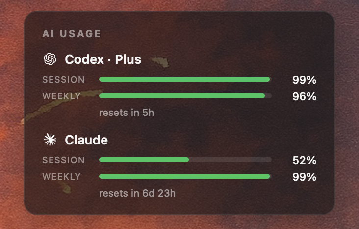

# cc-usagebar

[English](README.md) · 中文

Übersicht widget，把 Claude Code 和 Codex 的实时用量画在 macOS 桌面上：会话进度、周限额、重置倒计时一目了然。



做这个是因为 [CodexBar](https://github.com/steipete/CodexBar) 那个菜单栏 app 在某些 Mac 上图标注册失败（macOS Sequoia 偶尔会让 LSUIElement 类 app 默默罢工），但它的 CLI 完全可用。这个 widget 复用了 CodexBar 的数据接口和图标，只是把展示从菜单栏挪到了桌面上。

## 依赖

- macOS 14+
- [Übersicht](https://tracesof.net/uebersicht/) —— `brew install --cask ubersicht`
- [CodexBar CLI](https://github.com/steipete/CodexBar)（装好后 `codexbar` 在 `$PATH` 里）
- 已登录的 Claude Code CLI（拉 Claude 用量）
- 已登录的 Codex CLI（拉 Codex 用量）

## 安装

```bash
git clone https://github.com/XINHAO-ZHANG/cc-usagebar.git
cp cc-usagebar/codexbar.coffee \
  ~/Library/Application\ Support/Übersicht/widgets/
cp -r cc-usagebar/icons \
  ~/Library/Application\ Support/Übersicht/widgets/
```

打开 Übersicht，widget 出现在桌面右上角。

> **小提示**：如果 Übersicht 菜单栏图标看不到，去 **系统设置 → 通用 → 登录项与扩展 → "开机时打开"** 把 `/应用程序/Übersicht.app` 加进去再重启 app。macOS 没把它认作后台 app 之前不会分配菜单栏槽位。

## 自定义

改 `codexbar.coffee` 这几个地方：

| 字段 | 默认值 | 含义 |
|---|---|---|
| `refreshFrequency` | `300000` | 刷新间隔（毫秒，300000 = 5 分钟） |
| `top:` / `right:` | `50px` / `30px` | 位置 |
| `width:` | `280px` | 宽度 |
| `barColor:` | 绿/黄/红 | 颜色阈值（绿 > 50%，黄 20–50%，红 < 20%） |

保存即生效，Übersicht 自动重载。

## 致谢

- [CodexBar](https://github.com/steipete/CodexBar) by [@steipete](https://github.com/steipete) —— 提供 `codexbar` CLI 和这里用到的 SVG 图标
- [Übersicht](https://github.com/felixhageloh/uebersicht) by [@felixhageloh](https://github.com/felixhageloh) —— 桌面 widget 运行时

## 协议

MIT —— 见 [LICENSE](LICENSE)
